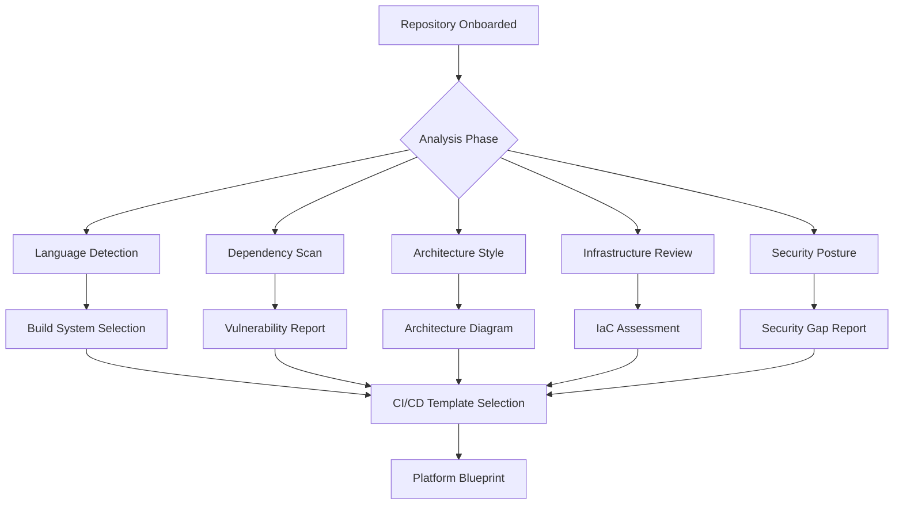
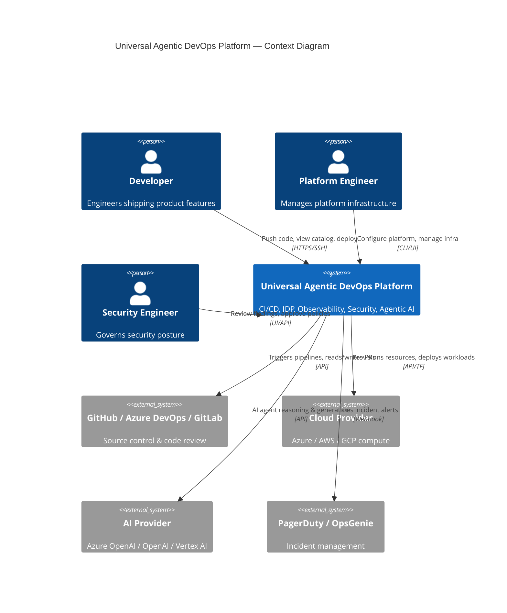
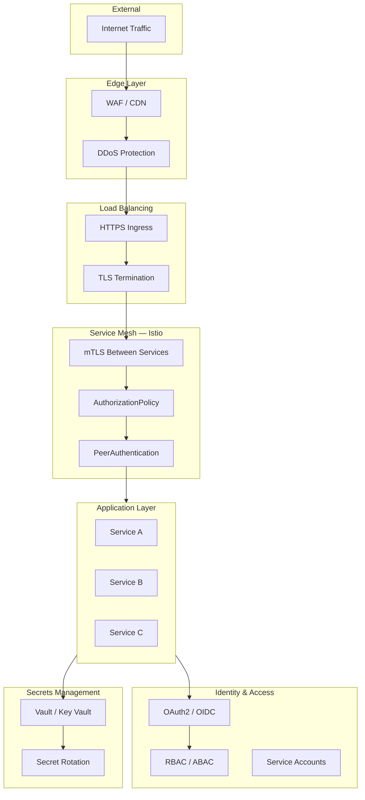
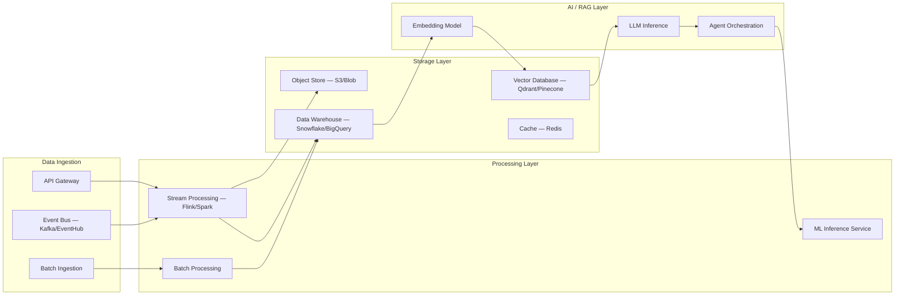

# Current State Architecture

> **Status:** Greenfield — No existing repository provided. This document describes the baseline platform before customization.

## Architecture Assessment Summary

| Dimension | Status | Notes |
|---|---|---|
| Source Repository | None | Greenfield platform generation |
| Architecture Style | N/A | Template covers all styles |
| CI/CD | Not configured | Templates provided in `.github/`, `azure-pipelines/`, `gitlab-ci/` |
| Containerization | Not started | Docker templates provided |
| Kubernetes | Not deployed | Helm charts provided |
| Infrastructure as Code | Not started | Terraform modules provided |
| Security Scanning | Not configured | Security baselines provided |
| Observability | Not configured | Prometheus/Grafana stack provided |
| Developer Portal | Not deployed | Backstage configuration provided |
| AI Agents | Not deployed | LangGraph agent specs provided |

---

## Target Technology Inventory

When a source repository is onboarded into this platform, the following inventory analysis should be performed:

---

## Platform Component Architecture

---

## CI/CD Architecture

```mermaid
flowchart LR
    subgraph DEV["Developer Workflow"]
        A[Local Dev] --> B[Pre-commit Hooks]
        B --> C[Push to Feature Branch]
    end
    
    subgraph CI["Continuous Integration"]
        C --> D[Trigger CI Pipeline]
        D --> E[Lint & Format]
        E --> F[Unit Tests]
        F --> G[SAST — SonarQube/CodeQL]
        G --> H[Secrets Scan — Gitleaks]
        H --> I[Build Container Image]
        I --> J[Container Scan — Trivy]
        J --> K[IaC Scan — Checkov]
        K --> L[SBOM Generation — Syft]
        L --> M[Image Sign — Cosign]
        M --> N[Push to Registry]
    end
    
    subgraph CD["Continuous Delivery"]
        N --> O{Branch?}
        O -- develop --> P[Deploy to Dev]
        O -- staging --> Q[Deploy to Staging]
        O -- main --> R[Deploy to Production]
        
        P --> S[Integration Tests]
        Q --> T[E2E Tests + DAST]
        R --> U[Smoke Tests + Canary]
    end
    
    subgraph OBS["Observability"]
        S --> V[Alert to Slack]
        T --> V
        U --> V
        V --> W[Grafana Dashboard]
    end
```

---

## Security Architecture — Zero Trust

---

## Data Flow Architecture

