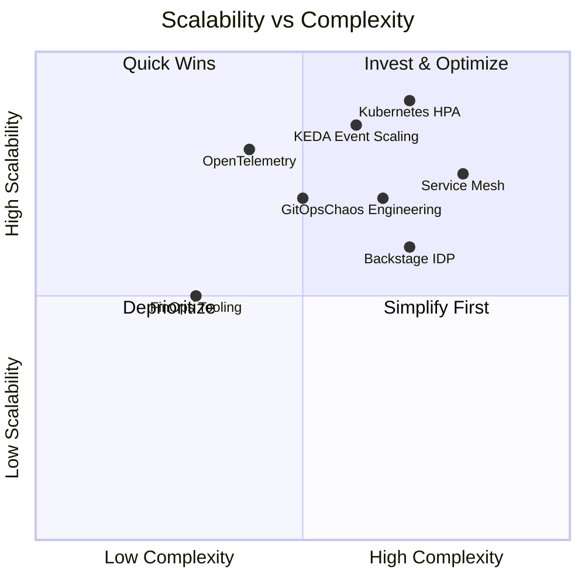

# Gap Analysis & Risk Matrix

## Risk Matrix

| # | Risk Area | Risk | Impact | Likelihood | Priority | Mitigation |
|---|---|---|---|---|---|---|
| 1 | Security | No secrets scanning in pipeline | Critical | High | P0 | Add Gitleaks pre-commit + CI step |
| 2 | Security | Container images not scanned | Critical | High | P0 | Add Trivy to build pipeline |
| 3 | Security | IaC not security-validated | High | High | P0 | Add Checkov/tfsec to CI |
| 4 | Reliability | No SLOs defined | High | Medium | P1 | Define SLOs in monitoring stack |
| 5 | Reliability | No DR strategy | High | Medium | P1 | Implement multi-region DR |
| 6 | DevOps | No automated rollback | High | Medium | P1 | Add Argo Rollouts / Flagger |
| 7 | Platform | No developer portal | Medium | High | P1 | Deploy Backstage IDP |
| 8 | FinOps | No cost visibility | Medium | High | P2 | Implement Kubecost / FinOps toolkit |
| 9 | Observability | No distributed tracing | Medium | High | P2 | Deploy OpenTelemetry collector |
| 10 | Compliance | No audit trail | High | Medium | P1 | Enable cloud audit logs + SIEM |
| 11 | AI Governance | No AI audit trail | High | Low | P2 | Implement LangSmith / custom audit |
| 12 | Scalability | No HPA/KEDA configured | Medium | Medium | P2 | Add HPA/KEDA policies to Helm |

---

## Technical Debt Assessment

### CI/CD Gaps
- [ ] No standardized pipeline templates across teams
- [ ] No quality gates (coverage thresholds, security score minimums)
- [ ] No automated dependency updates (Renovate/Dependabot)
- [ ] No environment promotion strategy
- [ ] No GitOps implementation (ArgoCD / Flux)

### Security Gaps
- [ ] No SBOM generation
- [ ] No image signing (supply chain)
- [ ] No runtime security (Falco)
- [ ] No pod security standards enforced
- [ ] No network policies (default allow-all)
- [ ] No WAF configuration
- [ ] No secret rotation automation

### Reliability Gaps
- [ ] No chaos engineering practice
- [ ] No error budgets
- [ ] No runbook automation
- [ ] No multi-region failover
- [ ] No backup verification automation

### Platform Engineering Gaps
- [ ] No internal developer portal
- [ ] No self-service infrastructure
- [ ] No golden path templates
- [ ] No service catalog
- [ ] No dependency tracking

### FinOps Gaps
- [ ] No resource tagging strategy
- [ ] No cost allocation by team/service
- [ ] No idle resource detection
- [ ] No reserved instance strategy
- [ ] No cost anomaly alerts

### Observability Gaps
- [ ] No standardized logging format (structured JSON)
- [ ] No distributed tracing
- [ ] No real user monitoring (RUM)
- [ ] No synthetic monitoring
- [ ] No SLO tracking dashboards

---

## Scalability Assessment

---

## Cost Optimization Report

### Quick Wins (< 1 week)
1. Enable cluster autoscaler on all node pools
2. Set resource requests/limits on all pods
3. Enable spot/preemptible instances for non-prod
4. Remove unused PersistentVolumes
5. Right-size oversized VM instances

### Medium Term (1-4 weeks)
1. Implement Kubecost for per-namespace cost visibility
2. Set up reserved instances for baseline production workloads
3. Implement HPA for all stateless services
4. Move batch workloads to spot instances
5. Enable storage tiering for cold data

### Long Term (1-3 months)
1. Multi-cloud arbitrage for compute-heavy workloads
2. Build FinOps dashboard in Backstage
3. Implement cost-aware scheduling (Karpenter)
4. Automated rightsizing recommendations
5. Chargeback/showback reporting per team
