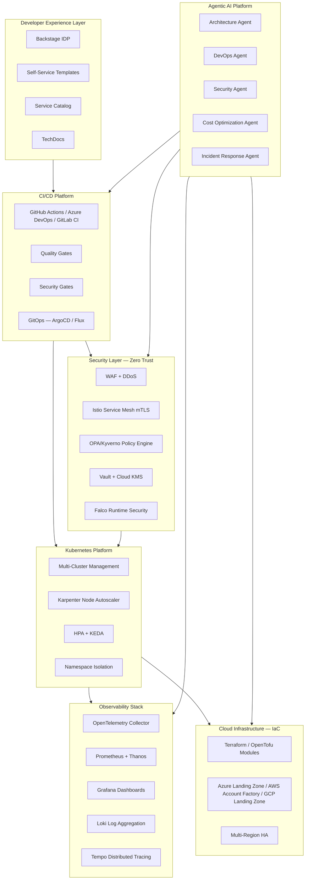
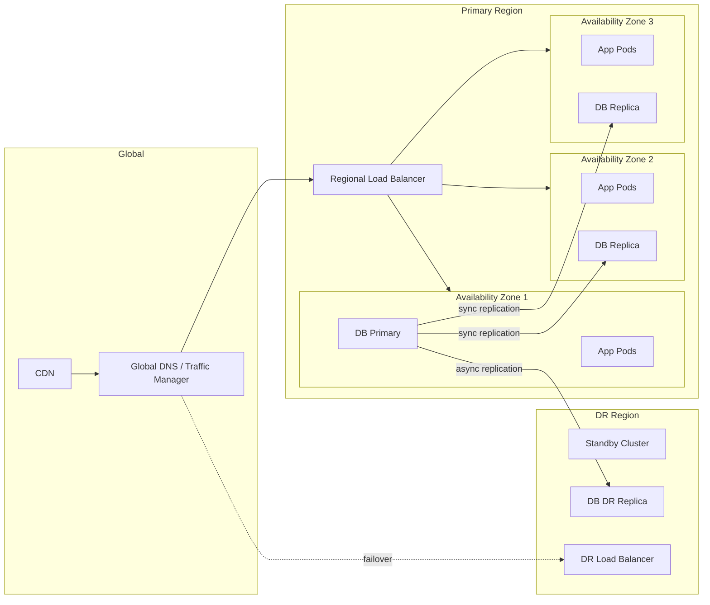
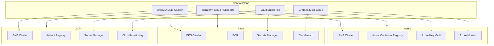
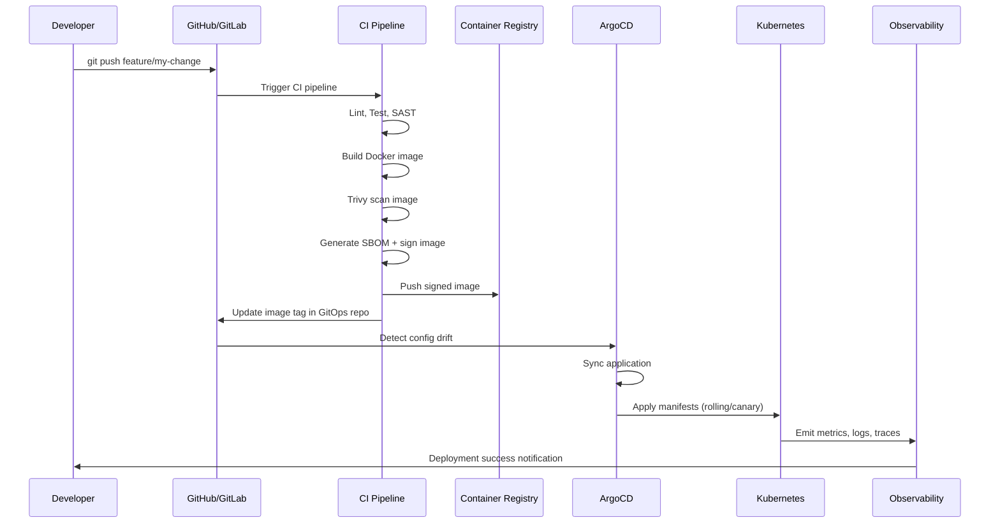
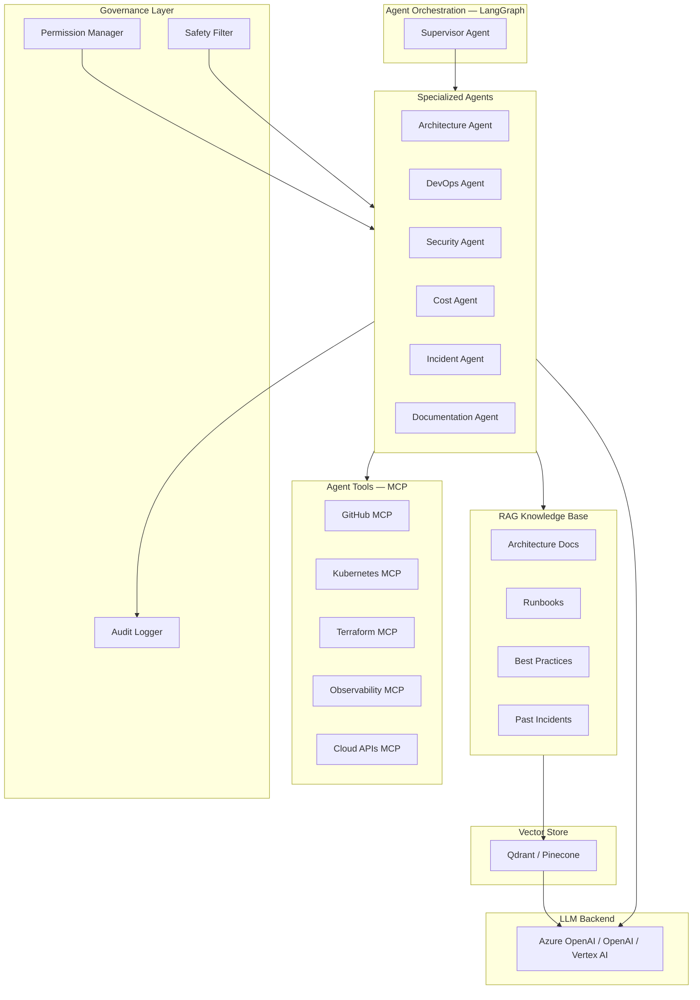

# Target State Architecture

## Future State Platform Architecture

---

## HA / DR Architecture

**RTO Target:** < 15 minutes  
**RPO Target:** < 5 minutes  
**Availability Target:** 99.95%

---

## Multi-Cloud Architecture

---

## Sequence: Application Deployment Flow

---

## Agentic AI Platform Architecture

