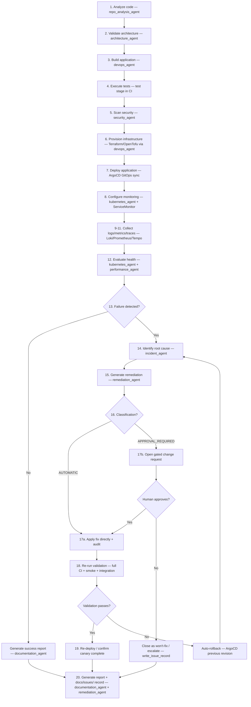
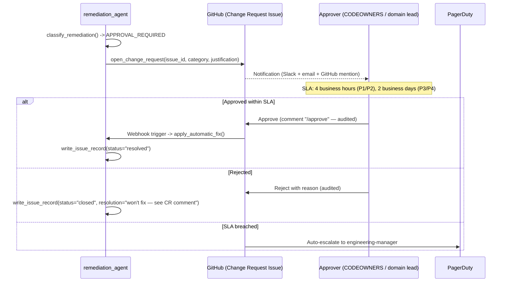

# Autonomous SDLC — Design & Operating Model

This document specifies how the platform's agents close the loop from "code
pushed" to "validated, observable, governed production system" with minimal
human intervention — and exactly where humans MUST stay in control.

It implements **Phase 6 (Autonomous SDLC)** and **Phase 7 (Auto-Remediation)**
of the Enterprise Agentic Foundry master prompt.

---

## The 20-Step Autonomous Loop

---

## Step-by-Step Agent Mapping

| # | Step | Owning Agent(s) | Key Tool(s) |
|---|---|---|---|
| 1 | Analyze code | `repo_analysis_agent` | `inventory_repository`, `detect_artifact_type` |
| 2 | Validate architecture | `architecture_agent` | `assess_technical_debt`, `recommend_modernization_path` |
| 3 | Build applications | `devops_agent` | CI/CD pipeline trigger via GitHub Actions/Azure DevOps |
| 4 | Execute tests | CI pipeline (unit/integration/contract) | `tests/integration/k8s-health.py`, language-native test runners |
| 5 | Scan security | `security_agent` | `scan_for_secrets`, `analyze_dependencies`, `scan_terraform`, `scan_kubernetes` |
| 6 | Provision infrastructure | `devops_agent` + Terraform/OpenTofu | `terraform plan/apply`, `shared-modules/terraform/*` |
| 7 | Deploy applications | ArgoCD (GitOps) | `argocd/app-of-apps.yaml`, Helm releases |
| 8 | Configure monitoring | `kubernetes_agent` | `ServiceMonitor`, Grafana provisioning |
| 9–11 | Collect logs / metrics / traces | Observability stack | Loki, Prometheus, Tempo (`observability/`) |
| 12 | Evaluate health | `kubernetes_agent`, `performance_agent` | `get_cluster_health`, `analyze_query_performance` |
| 13 | Detect failures | `incident_agent` | Alertmanager correlation, SLO burn-rate analysis |
| 14 | Identify root cause | `incident_agent` | Log/metric/trace correlation, "5 Whys" structured analysis |
| 15 | Generate remediation | `remediation_agent` | `generate_remediation_plan` |
| 16 | Classify risk | `remediation_agent` | `classify_remediation` (AUTOMATIC vs APPROVAL_REQUIRED) |
| 17a | Apply safe fixes | `remediation_agent` | `apply_automatic_fix` |
| 17b | Request approval | `remediation_agent` | `open_change_request` (routes to CODEOWNERS / domain leads) |
| 18 | Re-run validation | CI pipeline + `remediation_agent` | Full suite + `tests/smoke/smoke-test.sh` |
| 19 | Re-deploy | ArgoCD | Auto-sync on green; auto-rollback on regression |
| 20 | Generate reports | `documentation_agent`, `remediation_agent` | `generate_runbook`, `write_issue_record` → `docs/issues/` |

The **Supervisor Agent** (`agentic-ai/agents/supervisor.py`) orchestrates this
entire loop as a LangGraph fan-out/fan-in graph: steps 1, 2, 5, and parts of 12
run in parallel against shared context; steps 14–19 form a tight retry loop
with a hard cap (`max_remediation_attempts: 3`) before automatic escalation
to a human via PagerDuty.

---

## Where Humans MUST Stay in Control

This is not a "fully autonomous, no humans" platform — it is a
**human-on-the-loop** platform. The classification matrix in
`agentic-ai/agents/remediation_agent.py` is the enforcement mechanism:

### Agents may act automatically (no approval gate)
Formatting, linting, dependency **patch** updates, CI/CD config syntax fixes,
Docker layer/image optimizations, Helm template corrections (non-prod, or
prod via mandatory canary), monitoring/alert-rule syntax fixes.

### Agents MUST request human approval
IAM/RBAC changes, database schema/data changes, infrastructure deletion,
production rollbacks, security-policy changes (OPA/Kyverno/Falco/WAF/NetworkPolicy),
**LLM provider/routing changes**, scaling changes with material cost impact,
and major/breaking dependency upgrades.

This split is deliberate and audited (`governance_agent.audit_ai_governance`
verifies 100% of high-risk actions went through the gate — zero exceptions
is the only acceptable score).

---

## Approval Gate Mechanics

Every approval/rejection is captured in the `audit_trail` of the relevant
agent's `State` and surfaces in the Governance Agent's
`audit_ai_governance` and `generate_governance_scorecard` tools — this is
the SOC2 CC8 (Change Management) evidence trail.

---

## Validation Gates (must ALL pass before any re-deploy)

1. CI pipeline green (build, unit tests, lint, type-check)
2. Security scan clean — no new finding ≥ CVSS 7.0 (`security_agent`)
3. Integration tests pass (`tests/integration/k8s-health.py`)
4. Smoke tests pass (`tests/smoke/smoke-test.sh <env>`)
5. SLO burn-rate within budget for 30 minutes post-deploy
   (`runbooks/slo-burn.md` defines the budget and alert thresholds)

Failing **any** gate triggers automatic rollback (`ArgoCD sync to previous
revision` / `helm rollback`) and re-enters the loop at step 14 (root cause
analysis) — with the rollback itself logged as a new `docs/issues/` entry.

---

## Circuit Breakers on the Loop Itself

To prevent a "remediation storm" (an agent repeatedly attempting and failing
the same fix), the Supervisor enforces:

- **Max 3 remediation attempts** per `issue_id` before mandatory human escalation
- **Cooldown window** of 15 minutes between automated remediation attempts
  against the same resource
- **Blast-radius limits**: no more than 2 production services may be under
  active automated remediation simultaneously — a 3rd candidate queues and
  pages the SRE on-call instead

These thresholds are configurable in `agentic-ai/agents/supervisor.py` and
reviewed quarterly by the Governance Agent as part of the scorecard process.

---

## Reporting Output

Every loop iteration — successful or not — produces:

1. A `docs/issues/<ISSUE-ID>.md` record (`remediation_agent.write_issue_record`)
2. An updated entry in the relevant runbook if a new failure pattern was seen
   (`documentation_agent.generate_runbook`)
3. A structured telemetry event feeding the Grafana "AI Agents" dashboard
   folder (`monitoring/grafana/provisioning/dashboards.yaml`)
4. A rollup into the Governance Agent's quarterly scorecard
   (`generate_governance_scorecard`)

This closes the loop required by the master prompt: **"Generate reports"**
is not an afterthought — it is what makes the next iteration of the loop
smarter (via RAG ingestion of `docs/issues/` into the platform's vector store —
see `agentic-ai/rag/ingestion.py`).
