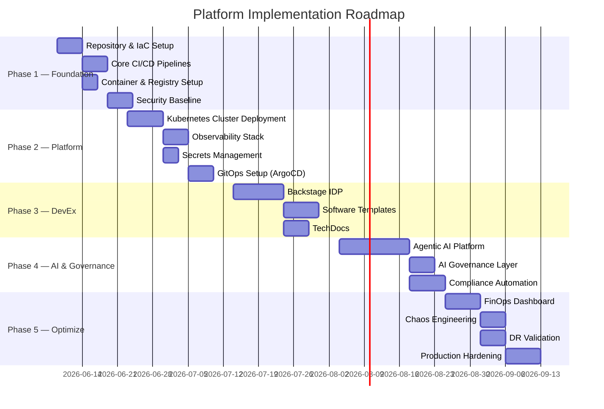

# Implementation Roadmap

## Overview

Phased 90-day enterprise implementation plan for the Universal Agentic DevOps Platform.

---

## Phase 1 — Foundation (Week 1–2)

### Objectives
- Establish secure, automated foundation for all subsequent work
- Achieve zero-drift infrastructure state from day 1

### Deliverables

| # | Deliverable | Owner | Effort | Priority |
|---|---|---|---|---|
| 1.1 | Git repository strategy (monorepo or polyrepo) | Platform Arch | 0.5d | P0 |
| 1.2 | Terraform state backend (Azure Blob / S3 / GCS) | Platform Eng | 1d | P0 |
| 1.3 | GitHub Actions CI pipeline (universal template) | DevOps Eng | 2d | P0 |
| 1.4 | Container registry (ACR/ECR/AR) with scanning | DevOps Eng | 1d | P0 |
| 1.5 | Docker multi-stage builds (Node/Python/Java) | DevOps Eng | 1d | P0 |
| 1.6 | Gitleaks pre-commit hooks | Security Eng | 0.5d | P0 |
| 1.7 | SonarQube setup + quality gates | DevOps Eng | 1d | P1 |
| 1.8 | Trivy image scanning in CI | DevOps Eng | 0.5d | P0 |
| 1.9 | Checkov IaC scanning | Security Eng | 0.5d | P0 |
| 1.10 | SBOM generation + image signing (Cosign) | Security Eng | 1d | P1 |

### Success Criteria
- [ ] All code changes trigger automated CI
- [ ] Zero secrets in git history
- [ ] Container images scanned before push
- [ ] IaC validated before apply
- [ ] Quality gates blocking broken builds

### Risks
| Risk | Mitigation |
|---|---|
| Existing pipelines break | Run new pipelines in parallel, migrate service by service |
| Registry migration | Use image mirroring during transition |

---

## Phase 2 — Platform Infrastructure (Week 3–4)

### Objectives
- Production-grade Kubernetes cluster with observability
- GitOps-based deployment model

### Deliverables

| # | Deliverable | Owner | Effort | Priority |
|---|---|---|---|---|
| 2.1 | AKS/EKS/GKE cluster (Terraform) | Cloud Eng | 3d | P0 |
| 2.2 | Kyverno pod security policies | Security Eng | 1d | P0 |
| 2.3 | Cert-Manager + Let's Encrypt | Platform Eng | 1d | P0 |
| 2.4 | External Secrets Operator + Key Vault | Security Eng | 2d | P0 |
| 2.5 | ArgoCD GitOps setup | DevOps Eng | 2d | P1 |
| 2.6 | Prometheus + Grafana stack | SRE | 2d | P0 |
| 2.7 | Loki log aggregation | SRE | 1d | P1 |
| 2.8 | Tempo distributed tracing | SRE | 1d | P1 |
| 2.9 | OpenTelemetry collector | SRE | 1d | P1 |
| 2.10 | SLO dashboards + alerting | SRE | 2d | P1 |
| 2.11 | PagerDuty / OpsGenie integration | SRE | 0.5d | P0 |

### Success Criteria
- [ ] AKS cluster running with 99.9%+ availability
- [ ] All pods meeting pod security standards
- [ ] Secrets sourced from Key Vault (zero hardcoded)
- [ ] SLO dashboards live for all P0 services
- [ ] On-call rotation configured and tested

---

## Phase 3 — Developer Experience (Week 5–6)

### Objectives
- Self-service platform with Backstage IDP
- Golden path templates for all service types

### Deliverables

| # | Deliverable | Owner | Effort | Priority |
|---|---|---|---|---|
| 3.1 | Backstage deployment (PostgreSQL backend) | Platform Eng | 3d | P1 |
| 3.2 | AD/GitHub authentication | Platform Eng | 1d | P1 |
| 3.3 | Service catalog seeding | Platform Eng | 2d | P1 |
| 3.4 | Microservice golden-path template | DevEx Eng | 3d | P1 |
| 3.5 | TechDocs pipeline | DevEx Eng | 2d | P2 |
| 3.6 | Kubernetes plugin | Platform Eng | 1d | P2 |
| 3.7 | Grafana plugin | SRE | 1d | P2 |
| 3.8 | Cost plugin (Kubecost) | FinOps Eng | 2d | P2 |

### Success Criteria
- [ ] Engineers can scaffold new service in < 5 minutes
- [ ] All services registered in catalog
- [ ] TechDocs published for P0 services
- [ ] Kubernetes status visible in Backstage

---

## Phase 4 — Agentic AI Platform (Week 7–8)

### Objectives
- Deploy AI agents for DevOps, Security, and Cost automation
- Establish AI governance with audit trail

### Deliverables

| # | Deliverable | Owner | Effort | Priority |
|---|---|---|---|---|
| 4.1 | Azure OpenAI / OpenAI provisioning | AI Platform Eng | 1d | P0 |
| 4.2 | Vector database (Qdrant) deployment | AI Platform Eng | 1d | P1 |
| 4.3 | RAG ingestion pipeline (docs + runbooks) | AI Platform Eng | 3d | P1 |
| 4.4 | Supervisor agent + routing | AI Platform Eng | 2d | P1 |
| 4.5 | DevOps agent (pipeline + deployment) | DevOps Eng | 3d | P1 |
| 4.6 | Security agent (scan + triage) | Security Eng | 3d | P1 |
| 4.7 | Cost optimization agent | FinOps Eng | 2d | P2 |
| 4.8 | Audit logger + safety filter | Security Eng | 2d | P0 |
| 4.9 | Backstage AI chat integration | DevEx Eng | 2d | P2 |
| 4.10 | LangSmith observability | AI Platform Eng | 1d | P2 |

### Success Criteria
- [ ] Agents handle > 50% of routine DevOps queries
- [ ] All agent actions logged with full audit trail
- [ ] No autonomous production deployments without approval
- [ ] Security findings triaged within 1 hour of detection

---

## Phase 5 — Optimization & Hardening (Week 9–12)

### Objectives
- Validate production readiness with chaos engineering
- Optimize costs and verify DR

### Deliverables

| # | Deliverable | Owner | Effort | Priority |
|---|---|---|---|---|
| 5.1 | Kubecost FinOps dashboard | FinOps Eng | 2d | P2 |
| 5.2 | Reserved instance / savings plan | FinOps Eng | 1d | P2 |
| 5.3 | Chaos engineering (Chaos Mesh) | SRE | 3d | P2 |
| 5.4 | DR exercise (full failover test) | SRE | 2d | P1 |
| 5.5 | Pen test / DAST full scan | Security Eng | 3d | P1 |
| 5.6 | SOC 2 control evidence collection | Security Eng | 5d | P1 |
| 5.7 | Karpenter node autoscaler tuning | Platform Eng | 2d | P2 |
| 5.8 | Multi-region deployment | Cloud Eng | 5d | P2 |

### Success Criteria
- [ ] RTO < 15 minutes validated in DR drill
- [ ] Chaos experiments pass with < 0.1% extra errors
- [ ] Cost reduced by > 20% vs. baseline
- [ ] All SOC 2 Type 2 controls evidenced

---

## 90-Day Success Metrics

| Metric | Baseline | 30-Day Target | 60-Day Target | 90-Day Target |
|---|---|---|---|---|
| Deployment frequency | Manual | Daily | Multiple/day | On-demand |
| Lead time (commit → prod) | Days | < 2 hours | < 30 min | < 15 min |
| Change failure rate | Unknown | < 10% | < 5% | < 2% |
| MTTR | Unknown | < 2 hours | < 1 hour | < 15 min |
| Security scan coverage | 0% | 80% | 95% | 100% |
| Platform adoption | 0 teams | 2 teams | 5 teams | All teams |
| AI agent task deflection | 0% | 10% | 30% | 50% |
| Infrastructure cost | Baseline | -5% | -15% | -25% |
