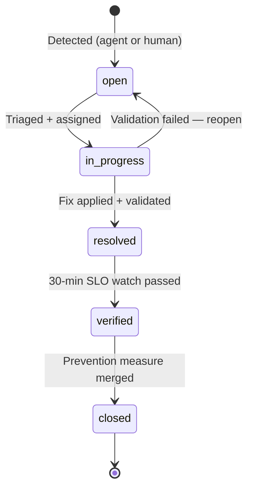

# Issue Management Framework

Every issue detected by the platform — whether by a human, the Incident
Response Agent, the Security Agent, or the autonomous SDLC loop's continuous
validation — gets a structured record in this directory: `docs/issues/<ISSUE-ID>.md`.

This is not a duplicate of GitHub Issues. It is the **permanent, auditable,
git-versioned evidence trail** that compliance frameworks (SOC2 CC7/CC8, ISO 27001
A.16) require: what happened, how we knew, what we did, and how we'll prevent
recurrence — surviving long after a GitHub issue is closed and archived.

## Issue ID Convention

```
<TYPE>-<YEAR>-<SEQUENCE>

INC-2026-0142   Incident (production impact)
SEC-2026-0031   Security finding
PERF-2026-0019  Performance degradation
COST-2026-0008  Cost/FinOps anomaly
GOV-2026-0004   Governance/compliance gap
DEBT-2026-0067  Technical debt item promoted to tracked issue
```

## Required Sections (every issue record MUST contain these — see `ISSUE-TEMPLATE.md`)

| Section | Purpose |
|---|---|
| Issue ID | Unique, immutable identifier |
| Severity | P1 (critical) / P2 (high) / P3 (medium) / P4 (low) — maps to `runbooks/` SLAs |
| Description | What happened, in plain language |
| Evidence | Links to logs (Loki), metrics (Grafana), traces (Tempo), screenshots |
| Root Cause | The actual underlying cause — "5 whys" minimum, not just the symptom |
| Resolution | What was changed and why it fixes the root cause (not just the symptom) |
| Files Changed | Every file touched, with PR/commit links |
| Validation | Checklist proving the fix works and didn't regress anything |
| Prevention | Regression test, alert, policy, or runbook update that stops recurrence |
| Status | `open` → `in_progress` → `resolved` → `verified` → `closed` |

## Who Creates These Records

| Source | Mechanism |
|---|---|
| Incident Response Agent | Auto-generated post-incident, links to the postmortem (`runbooks/`) |
| Auto-Remediation Agent | `write_issue_record()` tool — generated for EVERY remediation, automatic or gated |
| Security Agent | Auto-generated for any CVSS ≥ 7.0 finding (same-day SLA per `docs/CONTRIBUTING.md`) |
| Governance Agent | Generated when a compliance/policy audit surfaces a sustained violation |
| Humans | Manually for anything the agents can't yet detect — same template, same rigor |

## Lifecycle & SLAs



| Severity | Triage SLA | Resolution SLA | Postmortem Required |
|---|---|---|---|
| P1 — Critical (prod down / data loss / breach) | 15 min | 4 hours | Yes — within 48h |
| P2 — High (degraded prod, security CVSS ≥ 7.0) | 1 hour | 24 hours | Yes — within 5 days |
| P3 — Medium | 1 business day | 1 week | Optional |
| P4 — Low / tech debt | 1 week | Best effort, tracked in roadmap | No |

## Querying Issues

```bash
# All open P1/P2 issues
grep -rl "Severity: P[12]" docs/issues/ | xargs grep -l "Status: open\|Status: in_progress"

# Issues touching a specific file (blast-radius / recurrence analysis)
grep -rl "templates/nodejs-api" docs/issues/

# Issues by category for trend analysis (feeds governance_agent scorecard)
grep -rl "^# Issue SEC-" docs/issues/ | wc -l
```

The Governance Agent's `generate_governance_scorecard` tool aggregates this
directory on a schedule to compute trend metrics (issue volume by category/
severity, mean-time-to-resolution, recurrence rate) for leadership reporting.
